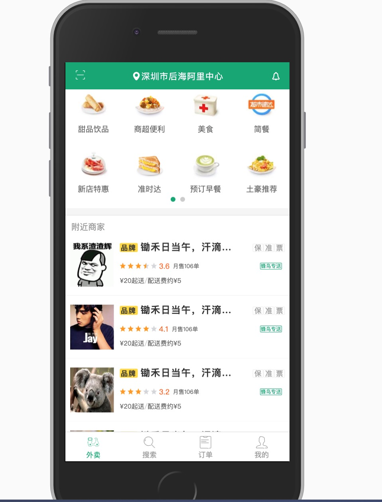
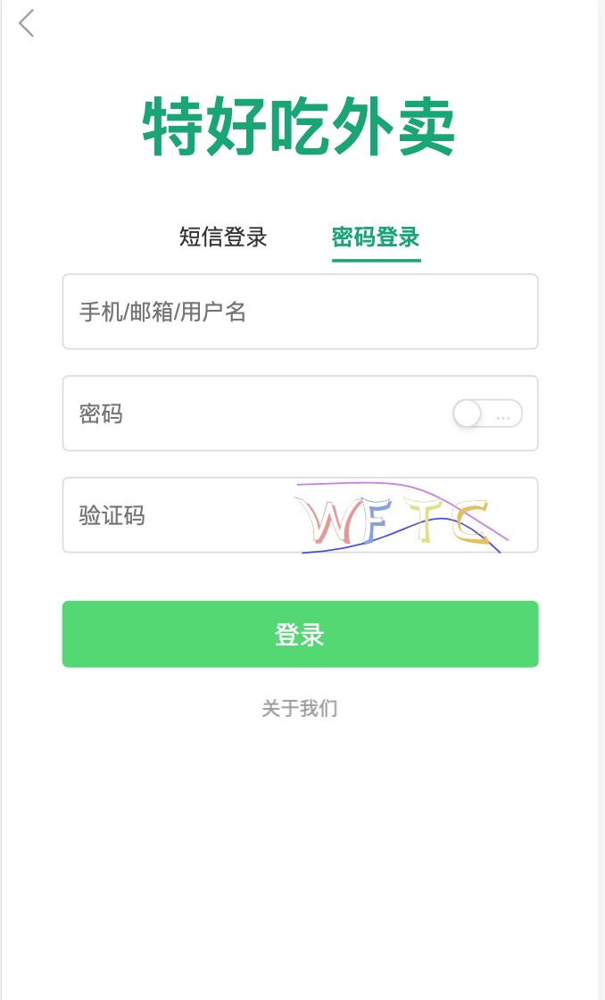
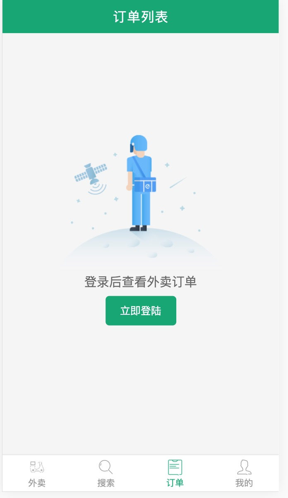
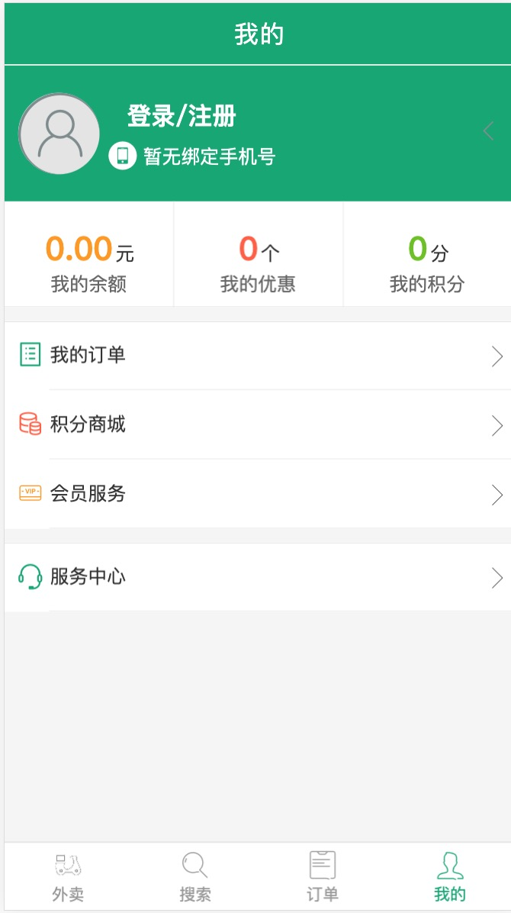

## 目录结构

### client 客户端，用户交互
  + [预览链接](https://react.xutong.top/)

#### 首页






### server 服务端，为 client 提供API服务
  + 包含 `api` 文档， `mock` 数据
  + data 目录下为原始数据，可以导入到 `MongoDB`

    ```
      db.shops.insertMany([...])
    ```
